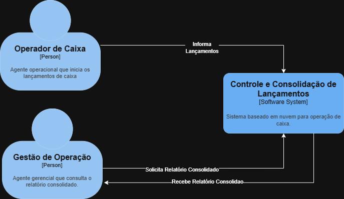
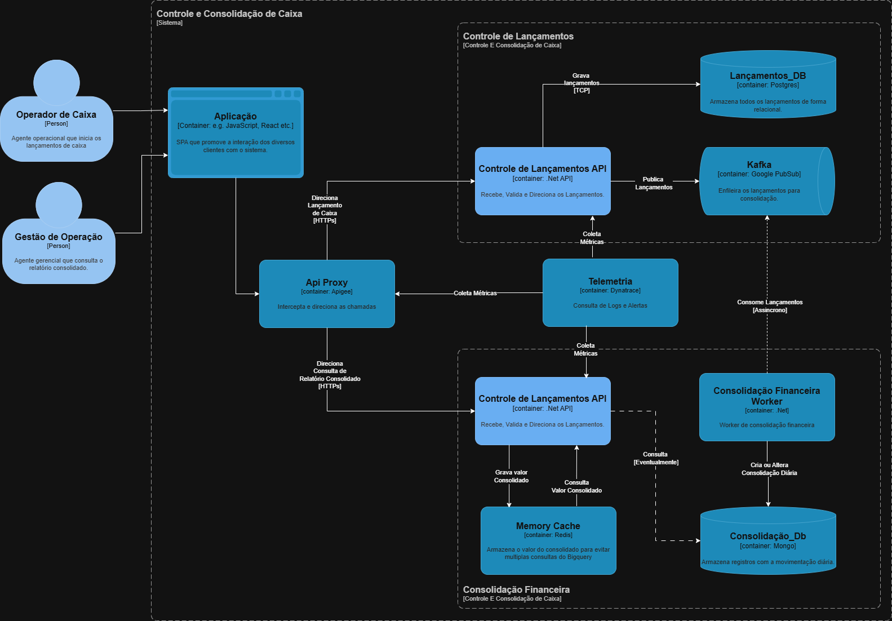

# Controle e Consolidação de Lançamentos

O presente repositório tem como objetivo fornecer uma solução arquiteturalmente adequada para o problema de um comerciante que visa: I - gravar todos os lançamentos de Débitos e Créditos de sua movimentação de caixa. II - Consultar o relatório consolidado da movimentação diária. As escolhas arquiteturais e de software visão garantir a escalabilidade, resiliência, segurança e alta disponibilidade dado os requisitos a frente listados. 

## Descrição do problema
Um comerciante precisa controlar seu fluxo de caixa diário com lançamentos (débitos e créditos) e gerar um relatório consolidado do saldo diário.  O serviço de  controle de lançamentos não pode ser impactado  caso o sistema de consolidado diário fique indisponível. Em dias de pico, o serviço de consolidado diário recebe  50 requisições por segundo, com  no máximo 5% de perda.

## Índice
WIP

## Como Executar
WIP

## Definição de contextos:

### Controle de Lançamentos:
 Responsável por receber, validar, e gravar cada um dos lançamentos feitos, possibilitando um relatório consolidado do movimento diário.

**Entidade Lançamento**
|Campo|Tipo| Descrição |
|--|--|--|
| Id | `Guid` | Identificador unitário de um evento de lançamento |
| Data | `DateTime`| Data e hora de geração do lançamento |
| NaturezaOperacao | `Enumeração` | Define o tipo daquele lançamento |
| Operador | `String` | Código de identificação do operador da lançamento |
| Descricao| `String` | Descrição opcional para o lançamento |
| Valor | `Double` | Valor do lançamento |
| NumeroLancamento| `Long` | Numero sequencial do referido lançamento |

**Enumeração Natureza Operação**
|Campo| Descrição |
|--|--|
| Crédito | Evento de entrada de valores ao Caixa |
| Débito | Evento de saída de valores do Caixa |
| Cancelamento de Crédito | Evento de estorno de valores saindo do Caixa |
| Cancelamento de Débito | Evento de estorno de valores voltando ao Caixa |

**Obs:** O tipo Guid foi utilizado na identificação para mitigar risco relacionados a valores de identificação sequenciais, considerando a devida perda de performance da indexação que será direcionada para o campo do Numero Lançamento, que por sua vez tem o seguinte comportamento: a cada lançamento da natureza: Crédito ou Débito um novo valor é criado, para os Cancelamentos o Numero Lançamento da transação original é repetido nesse campo relacionando os eventos sem sobrescrever o histórico.

### Consolidação Financeira:
 Responsável por gerar relatório consolidado diário com base nas informações recebidas do contexto de Controle de Lançamentos, e dispor deste relatório quando consultado.

**Entidade Consolidado**
|Campo|Tipo| Descrição |
|--|--|--|
| Id | `Guid` | Identificador unitário de um evento de lançamento |
| Data | `Date`| Data referencia da consolidação do relatório |
| DataCriacao | `DateTime`| Data da criação do registro |
| DataAlteracao | `DateTime`| Data da última alteração do registro |
| QuantidadeCredito| `int` | Sumariza a quantidade de eventos de lançamento de Crédito |
| ValorCredito| `Double` | Sumariza o valor de todas os eventos de lançamento de Crédito |
| QuantidadeCancelamentoCredito| `int` | Sumariza a quantidade de eventos de lançamento de cancelamento de Crédito |
| ValorCancelamentoCredito| `Double` | Sumariza o valor de todas os eventos de lançamento de cancelamento de Crédito |
| QuantidadeDebito| `int` | Sumariza a quantidade de eventos de lançamento de Debito |
| ValorDebito| `Double` | Sumariza o valor de todas os eventos de lançamento de Debito |
| QuantidadeCancelamentoDebito| `int` | Sumariza a quantidade de eventos de lançamento de cancelamento de Debito |
| ValorCancelamentoDebito| `Double` | Sumariza o valor de todas os eventos de lançamento de cancelamento de Debito |
| ValorTotal| `Double` | Valor final de todos os lançamentos |

### Linguagem Compartilhada:
  
|Termo | Definição|
|--|--|
|Caixa| Entidade que acumula os valores dos lançamentos|
|Cancelamento| Define evento de lançamento com objetivo de reverter as ações de crédito ou débito, sem sobrescrevê-las.|
|Controle de Lançamentos | Define o contexto acima citado de mesmo nome, como especificado.|
|Consolidação Financeira | Define o contexto acima citado de mesmo nome, como especificado.|
|Crédito| Define evento de lançamento onde há entrada de valores no caixa.|
|Débitos| Define evento de lançamento onde há saída de valores do caixa.|
|Lançamento| Unidade do evento do registro de uma operação da movimentação do caixa. |
|Relatório| Entidade que mostra os valores finais sumarizados de todos os lançamentos de um dia. |

## Requisitos

**Funcionais:**
-   **Controle de Lançamentos:**
	-   Deve possuir uma interface que permita gravar cada lançamento.
	-   Deve gravar os lançamentos com os tipos: 
		- Crédito
		- Débito
		- Cancelamento de Créditos
		- Cancelamento de Débitos.
	-   Deve-se garantir que o histórico de lançamentos seja auditável.
    

- **Consolidação Financeira:**
	-   Deve possuir interface que permita a consulta do relatório diário.
	-   Deve criar um novo registro de Consolidação Financeira para cada dia de movimentação de caixa.
	-   Deve alterar o registro consolidado para cada novo lançamento.

**Não Funcionais:**
-   É necessário que as interações do sistema com usuários sejam protegidas por Autenticação e Autorização granular para cada tipo de evento.
-   O sistema deve dispor de criptografia para garantir a segurança do dado em trânsito.
-   O contexto Consolidação Financeira deve ser capaz de receber 50 requisições por segundo, com máximo de 5% de falha. Perda máxima de 2.5 requisições a cada 50.
-   O Contexto de Controle de lançamentos não pode ter sua performance impactada por falhas no contexto de Consolidação Financeira.
-   O sistema deve ter estratégias de recuperação de falha e escalabilidade horizontal para garantir a disponibilidade.
-   O sistema deve possuir alertas baseados em sua observabilidade para garantir a atuação da sustentação se necessário.

## Desenho da Arquitetura
### C1 - Contexto

### C2 - Container

**Obs:** Não haviam dados suficientes a respeito da volumetria diária total para calcular efetivamente os custos da utilização do sistema em nuvem, a estratégia utilizada foi organizar os componentes em serviços utilizando interfaces que possam substituir as atuais ferramentas no futuro, bem como as presentes ferramentas foram escolhidas com os seguintes critérios: 
- **Especificações de utilização do projeto:** Como determinada ferramenta se resolve as necessidades e problemas apresentados no escopo da aplicação.
 -  **Licenciamento open source**: Ferramentas que possam ser utilizadas sem custo de licenciamento para em ambiente produtivo ou desenvolvimento.
 - **Intercambialidade com serviços de nuvem**: Ferramentas que apresentem comportamentos semelhantes ou que tenham similares na nuvem: Ex. Kubernets (AKS, EKS, GKE).

Componentes:
:large_blue_circle: **Aplicação**
:small_blue_diamond: Frontend único que centraliza as operação de lançamento e recuperação de relatório consolidado.
:small_blue_diamond: React foi escolhido devido a [sua popularidade](https://survey.stackoverflow.co/2025/technology), a fim de facilitar a contratação.

:large_blue_circle: **Api Proxy**
:small_blue_diamond: Responsável por criar um ponto de acesso único para ambas as aplicações.
:small_blue_diamond: WIP

:large_blue_circle: **Controle de Lançamentos**
:small_blue_diamond: **Kubernets** - Responsável por manter a escalabilidade horizontal do serviço e garantir sua recuperação de falhas.  Tecnologia escolhida dada a intercambialidade com serviços de nuvem.
:small_blue_diamond: **Controle de Lançamentos API** - Responsável por receber os lançamentos, validar, comunicar ao tópico e gravar no banco de dados. .Net Core foi escolhida pela familiaridade do desenvolvedor e adequação com o projeto.
:small_blue_diamond: **Lançamentos_Db** - responsável por armazenar os dados dos lançamentos. Postgres foi adotado como tecnologia por ser de código aberto, com facilidade de integração nas principais nuvem sem o custo de licenciamentos que as ferramentas da Oracle e Microsoft teriam.
:small_blue_diamond: **Kafka** - Responsável por armazenar as mensagens dos lançamentos para o serviço de Consolidação, também podendo ser utilizado como uma estratégia de redundância para recuperação de dados comprometidos no postgres considerando o limite da retenção dos dados. Será utilizado o padrão *Publisher-Subscriber* que pode ser implementado com as principais ferramentas gerenciadas dos serviços de nuvem.

:large_blue_circle: **Telemetria**
:small_blue_diamond: Possibilita a consulta de logs e criação de alertas para comportamentos fora da curva.
:small_blue_diamond: WIP

:large_blue_circle: **Consolidação Financeira**
:small_blue_diamond: **Kubernets** - Responsável por manter a escalabilidade horizontal do serviço e garantir sua recuperação de falhas.  Tecnologia escolhida dada a intercambialidade com serviços de nuvem.
:small_blue_diamond: **Consolidação Financeira API** - Responsável por viabilizar a consulta ao relatório consolidado. .Net Core foi escolhida pela familiaridade do desenvolvedor e adequação com o projeto.
	:small_blue_diamond: **Woker Consolidação financeira** - Responsável por realizar os devidos cálculos do relatório consolidado. .Net Core foi escolhido como tecnologia pois possibilita a criação de App pequenos, caso consideremos no futuro nuvens podemos facialmente transacionar esse serviço para uma função (Az. Functions, AWS Lambda, GCP Functions).
:small_blue_diamond: **Consolidação_Db** - Responsável por armazenar os dados da consolidação dos lançamentos. Dado a realidade não relacional deste dado e a consulta constante ao valor descrita nos requisitos por isso o MongoDb foi escolhido como tecnologia.
:small_blue_diamond: **Cache** - Faz parte de estratégia de resiliência da aplicação a fim de mitigar problemas de concorrência constante com o banco, em um curto período definido (ex. 3 minutos) o valor inicial obtido é mantido em cache para que as várias consultas simultâneas (como descrito nos requisitos) enfrentem o menor percentual de falha. Redis foi escolhido como tecnologia pela sua intercambialidade com os principais provedores de nuvem.

### Considerações sobre Tecnologias
:white_check_mark: Arquitetura de Microserviços 
Escolha motivada pelos requisitos de escalabilidade individual e mitigação de falhas entre os serviços, a fim de construir uma estrutura resiliente com possibilidade de recuperação de mensagens. Há uma possível melhoria em relação a haver dois serviços, a saber: Consolidação Financeira API e Consolidação Financeira Worker utilizando a mesma base de dados, o que fere princípios da arquitetura escolhida. Para tal escolha considero que manter essas responsabilidades separadas promove uma melhor escalabilidade, falhas segregadas gerando menor impacto na  recuperação do sistema, otimização dos recursos com foco na especialidade de cada serviço, e como citei anteriormente a flexibilidade de utilização de diferentes produtos com transformar o Worker em uma função serverless. Adiciono também os déficits dessa abordagem: Maior acoplamento com o banco impedindo que cada aplicação evolua individualmente sem impactar na outra, riscos relacionados a compatibilidade de ambos os projetos pois agora ambos dependem de uma terceira tecnologia, se esta mudar será necessário alterar as implementações de ambos sistemas.

:white_check_mark: Eventos únicos e Mensageria 
Como foi possível notar na sessão de modelagem dos domínios ao trabalhar com os Controle de lançamentos transacionais não será possível a edição ou deleção do registro, antes, será necessário um novo registro que sobrescreva as ações do lançamento anterior. Exemplo: Um débito não pode ter seu registro cancelado ou apagado, será necessário fazer um novo registro com natureza de `Cancelamento de Débito` para remover aquele débito. Isso garante: I - Rastreamento completo do ciclo de vida de um Lançamento, recuperando todos os registros a ele associados. II - Garante a consistência do relatório consolidado, mesmo que hajam interrupções ou que as mensagens sejam entregues de forma desordenada. Para completar implementação a mensageria é utilizada no modelo Publisher-Subscriber, garantindo consistência dos valores, sem alterar a performance das aplicações críticas da ponta.

